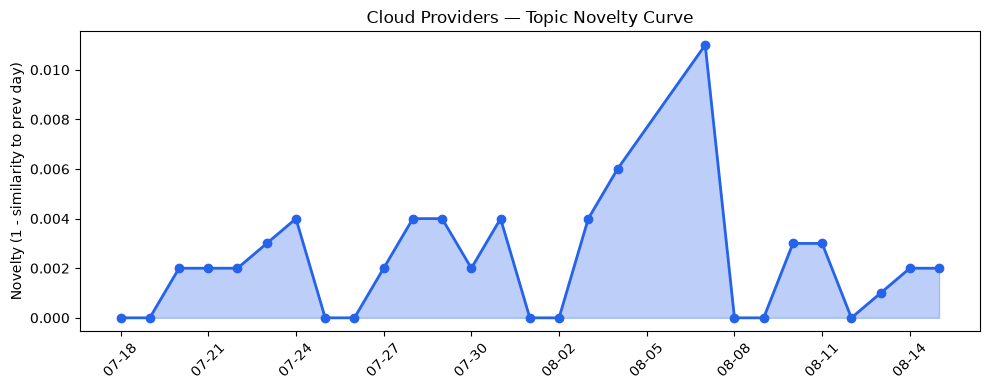
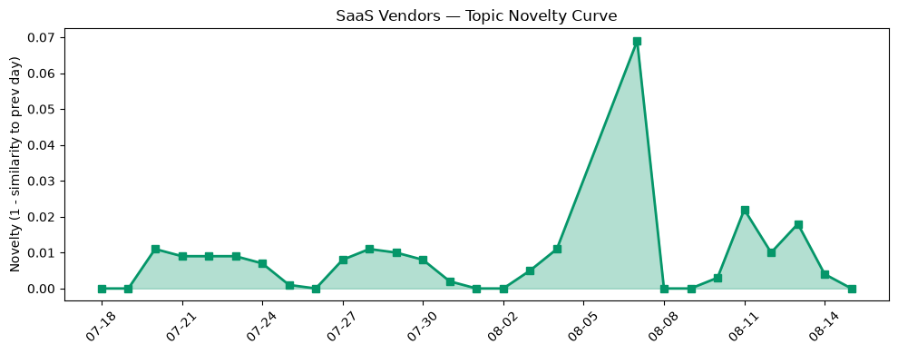

## 今日云计算结构性变化
> 今日云计算和SaaS领域的结构性变化主要体现在技术层、基础设施和应用层的进展。
云计算和SaaS领域的领先者如AWS、Salesforce、Google Cloud和Azure等在AI、数据分析和基础设施方面取得了显著进展，推动了企业的数字化转型和市场需求的变化。这些进展包括AWS推出的Amazon Bedrock AgentCore，Google Cloud的BigQuery Graphs和post-quantum cryptography roadmap等。
- 📈 **持续趋势**：技术层话题已连续8天增强
- 🆕 **新兴方向**：应用层话题为30天内首次出现
- 🔺 **突然升温**：基础设施和技术层近3天突然集中出现

## 技术层信号
🔴 重大突破

云原生和安全技术的进展是今日技术层信号的主要内容。AWS推出的Amazon Bedrock AgentCore，Google Cloud的BigQuery Graphs和post-quantum cryptography roadmap体现了云原生和安全技术的进展。同时，AWS DynamoDB现在支持实时向量搜索，具有单位毫秒级延迟和99%+的召回率，Google Cloud的Gemini Enterprise和Database Migration Service更新反映了基础设施的改进。
如 [AWS Weekly Roundup: AWS Heroes Summit, Web Search on Amazon Bedrock, Dogwood, Kiro Crew, and more (August 10, 2026)](https://aws.amazon.com/blogs/aws/aws-weekly-roundup-aws-heroes-summit-web-search-on-amazon-bedrock-dogwood-kiro-crew-and-more-august-10-2026/) 和 [What’s new with Google Cloud](https://cloud.google.com/blog/topics/inside-google-cloud/whats-new-google-cloud/) 等文章所述。

## 产业资本信号
🔴 强信号

今日产业资本信号主要体现在基础设施和应用层的变化。AWS推出Local Zone在雅典，扩大区域覆盖，Google Cloud的Alisios、Canoa和OlaLuz子海缆项目扩展了其基础设施。同时，Salesforce推出Headless 360架构，支持更广泛的行业应用，Azure推出了新的行业解决方案。
如 [AWS Weekly Roundup: Local Zone in Athens, Claude Opus 5 on AWS, Lambda durable execution for .NET, and more (July 27, 2026)](https://aws.amazon.com/blogs/aws/aws-weekly-roundup-july-27-2026/) 和 [Expanding connectivity in the Americas: Introducing Alisios, Canoa, and OlaLuz subsea cables](https://cloud.google.com/blog/products/infrastructure/introducing-americas-connect/) 等文章所述。

## 潜在拐点判断
今日观察到多个潜在拐点信号，包括技术层、基础设施和应用层的进展。这些进展可能会推动企业的数字化转型和市场需求的变化。然而，需要继续观察这些信号的发展，判断是否会形成长期的趋势。

## 明日观察点
1. 观察技术层信号的发展，特别是云原生和安全技术的进展。
2. 关注基础设施和应用层的变化，特别是AWS、Google Cloud和Salesforce等领先者的动向。
3. 分析产业资本信号，特别是基础设施和应用层的投资和并购动向。

## 长期趋势坐标
今日信号表明，云计算和SaaS领域的技术进展和结构性变化可能会推动企业的数字化转型和市场需求的变化。这些进展可能会形成长期的趋势，推动云计算和SaaS领域的发展。

## 数据洞察
### 云厂商话题演化
今日云厂商话题演化的主要内容包括AWS、Google Cloud和Azure等领先者的技术进展和基础设施的变化。如 [AWS Weekly Roundup: AWS Heroes Summit, Web Search on Amazon Bedrock, Dogwood, Kiro Crew, and more (August 10, 2026)](https://aws.amazon.com/blogs/aws/aws-weekly-roundup-aws-heroes-summit-web-search-on-amazon-bedrock-dogwood-kiro-crew-and-more-august-10-2026/) 和 [What’s new with Google Cloud](https://cloud.google.com/blog/topics/inside-google-cloud/whats-new-google-cloud/) 等文章所述。

### SaaS 厂商话题演化
今日SaaS厂商话题演化的主要内容包括Salesforce等领先者的应用层进展和数字化转型的推动。如 [The 5 Systems that Power the Headless 360 Architecture](https://www.salesforce.com/blog/systems-headless-360-architecture/) 和 [Scale Customer Support With AI Agents: 5 Service Tips For SMBs](https://www.salesforce.com/blog/small-business/customer-support-tips-with-ai-agents/) 等文章所述。

### 趋势图

## 参考来源
- [AWS Weekly Roundup: AWS Heroes Summit, Web Search on Amazon Bedrock, Dogwood, Kiro Crew, and more (August 10, 2026)](https://aws.amazon.com/blogs/aws/aws-weekly-roundup-aws-heroes-summit-web-search-on-amazon-bedrock-dogwood-kiro-crew-and-more-august-10-2026/)
- [What’s new with Google Cloud](https://cloud.google.com/blog/topics/inside-google-cloud/whats-new-google-cloud/)
- [PQC in Plaintext: Google Cloud’s post-quantum cryptography roadmap](https://cloud.google.com/blog/products/identity-security/pqc-in-plaintext-google-clouds-post-quantum-cryptography-roadmap/)
- [The Economics of Agent Optimization: From pilots to measurable returns](https://azure.microsoft.com/en-us/blog/the-economics-of-agent-optimization-from-pilots-to-measurable-returns/)
- [火山引擎正式推出四款数据产品 将持续完善敏捷数智引擎矩阵](https://www.cnblogs.com/volcengine/p/15640481.html)
- [Unveiling good and bad behaviors on the Agentic Internet](https://blog.cloudflare.com/good-and-bad-agentic-behaviors/)
- [Introducing Radar Researcher: An AI tool for exploring Internet data in plain language](https://blog.cloudflare.com/introducing-radar-researcher/)
- [Amazon DynamoDB now supports real-time vector search at any scale](https://aws.amazon.com/blogs/aws/amazon-dynamodb-now-supports-real-time-vector-search-at-any-scale/)
- [Expanding connectivity in the Americas: Introducing Alisios, Canoa, and OlaLuz subsea cables](https://cloud.google.com/blog/products/infrastructure/introducing-americas-connect/)
- [AT&T and Microsoft scale trillion-token workloads with Microsoft Foundry and AMD](https://azure.microsoft.com/en-us/blog/att-and-microsoft-scale-trillion-token-workloads-with-microsoft-foundry-and-amd/)
- [Scale Customer Support With AI Agents: 5 Service Tips For SMBs](https://www.salesforce.com/blog/small-business/customer-support-tips-with-ai-agents/)
- [The 5 Systems that Power the Headless 360 Architecture](https://www.salesforce.com/blog/systems-headless-360-architecture/)
- [What customers value most in Microsoft Databases—from reliability to AI readiness](https://azure.microsoft.com/en-us/blog/what-customers-value-most-in-microsoft-databases-from-reliability-to-ai-readiness/)
- [字节跳动是如何建设云的？](https://www.cnblogs.com/volcengine/p/15633967.html)
- [Pardot alternatives: What B2B marketers are choosing now](https://blog.hubspot.com/marketing/pardot-alternatives)
- [Anthropic shares more details about how Claude’s new watermarks will work](https://techcrunch.com/2026/08/15/anthropic-shares-more-details-about-how-claudes-new-watermarks-will-work/)
- [Talks to sell PayPal to Stripe and Advent are heating up](https://techcrunch.com/2026/08/14/talks-to-sell-paypal-to-stripe-and-advent-are-heating-up/)
- [Amazon and Chobani adopt Strella's AI interviews for customer research as fast-growing startup raises $14M](https://venturebeat.com/technology/amazon-and-chobani-adopt-strellas-ai-interviews-for-customer-research-as)
- [How Anthropic’s ‘Skills’ make Claude faster, cheaper, and more consistent for business workflows](https://venturebeat.com/technology/how-anthropics-skills-make-claude-faster-cheaper-and-more-consistent-for)
- [Announcing Cloudflare Ambassadors, Community Engineers, and another $1M in open-source funding](https://blog.cloudflare.com/community-program-refresh/)
- [What we know about the alleged Iranian hacks on US water utilities](https://techcrunch.com/2026/08/14/what-we-know-about-the-alleged-iranian-hacks-on-u-s-water-utilities/)
- [Tokenization takes the lead in the fight for data security](https://venturebeat.com/technology/tokenization-takes-the-lead-in-the-fight-for-data-security)
- [ChainDrop worm crawls into npm supply chain, evades standard defenses](https://www.theregister.com/security/2026/08/15/chaindrop-worm-crawls-into-npm-supply-chain-evades-standard-defenses/5287958)
- [1.6M RingCentral accounts' data dumped after ShinyHunters extortion attack](https://www.theregister.com/cyber-crime/2026/08/14/16m-ringcentral-accounts-data-dumped-after-shinyhunters-extortion-attack/5288003)
- [French tax authority admits data heist after crook touts 2M records](https://www.theregister.com/security/2026/08/14/french-tax-authority-admits-data-heist-after-crook-touts-2m-records/5287885)