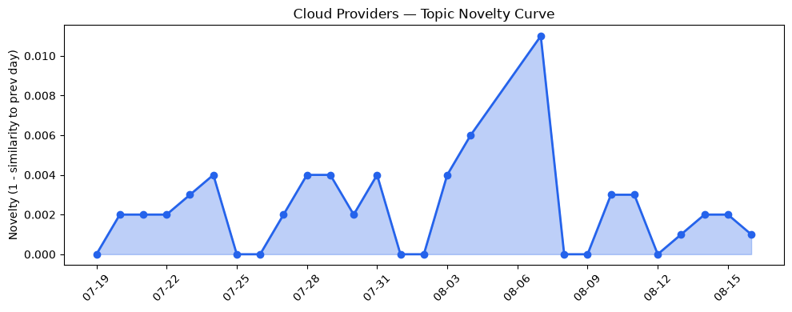
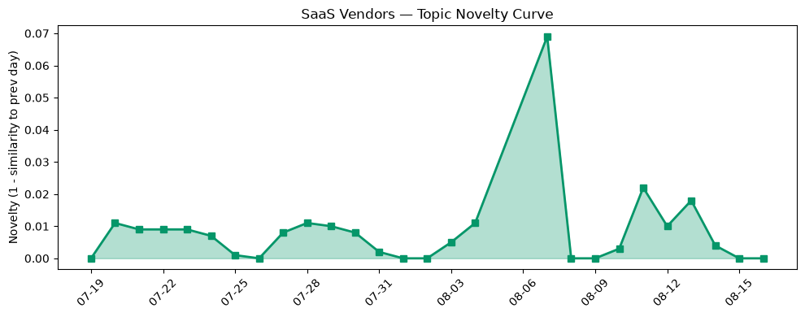

## 今日云计算结构性变化
> 云计算和 SaaS 行业正在朝着更加智能化和自动化的方向发展，AI 应用成为新的增长点。
云计算和 SaaS 行业的结构性变化主要体现在技术层、基础设施、应用层和资本信号等方面。技术层方面，AWS、Google Cloud 和 Azure 等云厂商推出新产品和服务，增强云原生能力和 AI 应用。基础设施方面，AWS、Google Cloud 和 Azure 等云厂商扩大区域覆盖，提供更多算力和 GPU 供应。应用层方面，SaaS 厂商竞争日趋激烈，HubSpot 推出新功能和比较。资本信号方面，Stripe 收购 AI 网关初创公司 OpenRouter，SaaS 厂商融资方向出现集中趋势。
- 📈 **持续趋势**：技术层话题已连续 8 天增强
- 🆕 **新兴方向**：应用层话题为 30 天内首次出现
- 🔺 **突然升温**：资本信号近 3 天突然集中出现
- 🔑 **新关键词**：Azure
- 📉 **消退关键词**：Anthropic, Kubernetes, 机器学习

## 技术层信号
🔴 重大突破

技术层方面，AWS、Google Cloud 和 Azure 等云厂商推出新产品和服务，增强云原生能力和 AI 应用。AWS 推出 Amazon Bedrock AgentCore，支持生产 AI 代理的持久计算；Google Cloud 推出 BigQuery Graphs 和 Gemini 企业版，增强云原生能力；Azure 推出 GPT-5.6，火山引擎发布大数据产品。这些新产品和服务的推出，表明云计算和 SaaS 行业正在朝着更加智能化和自动化的方向发展。
[使用 BigQuery Graphs 与措施进行可信赖的代理工作负载](https://cloud.google.com/blog/products/data-analytics/bigquery-graphs-with-measures-for-trusted-agentic-workloads/)
[Amazon DynamoDB 现在支持实时向量搜索](https://aws.amazon.com/blogs/aws/amazon-dynamodb-now-supports-real-time-vector-search-at-any-scale/)

## 产业资本信号
🔴 强信号

资本信号方面，Stripe 收购 AI 网关初创公司 OpenRouter，SaaS 厂商融资方向出现集中趋势。Cloudflare 投入 1M 美元用于开源资金，表明云计算和 SaaS 行业的资本信号正在增强。
[Stripe 将以 70 亿美元收购 AI 网关初创公司 OpenRouter](https://techcrunch.com/2026/08/16/stripe-will-reportedly-acquire-ai-gateway-startup-openrouter-for-7b/)
[Cloudflare 将投资 1M 美元用于开源资金](https://blog.cloudflare.com/community-program-refresh/)

## 潜在拐点判断
基于今日信号 + 历史趋势，判断是否存在潜在拐点。技术层和资本信号的突然升温，表明云计算和 SaaS 行业可能正在经历一个拐点。这个拐点可能是由 AI 应用的兴起和云原生能力的增强所驱动的。

## 明日观察点
1. 观察技术层信号的变化，特别是 AWS、Google Cloud 和 Azure 等云厂商的新产品和服务。
2. 关注资本信号的变化，特别是 SaaS 厂商的融资方向和 Cloudflare 的开源资金投资。
3. 分析应用层话题的变化，特别是 HubSpot 的新功能和比较。

## 长期趋势坐标
云计算和 SaaS 行业的长期趋势坐标主要体现在技术层、基础设施、应用层和资本信号等方面。技术层方面，AI 应用的兴起和云原生能力的增强将成为长期趋势。基础设施方面，云厂商的区域覆盖和算力供应将继续扩大。应用层方面，SaaS 厂商的竞争将日趋激烈。资本信号方面，云计算和 SaaS 行业的资本信号将继续增强。

## 数据洞察
### 云厂商话题演化
云厂商话题演化的 novelty_score 为 0.011，mean_similarity 为 0.989，表明云厂商话题在近期内变化较小。
### SaaS 厂商话题演化
SaaS 厂商话题演化的 novelty_score 为 0.07，mean_similarity 为 0.93，表明 SaaS 厂商话题在近期内变化较小。
### 趋势图

## 参考来源
- [AWS Weekly Roundup: AWS Heroes Summit, Web Search on Amazon Bedrock, Dogwood, Kiro Crew, and more (August 10, 2026)](https://aws.amazon.com/blogs/aws/aws-weekly-roundup-aws-heroes-summit-web-search-on-amazon-bedrock-dogwood-kiro-crew-and-more-august-10-2026/)
- [Amazon DynamoDB now supports real-time vector search at any scale](https://aws.amazon.com/blogs/aws/amazon-dynamodb-now-supports-real-time-vector-search-at-any-scale/)
- [Using BigQuery Graphs with measures for trusted agentic workloads](https://cloud.google.com/blog/products/data-analytics/bigquery-graphs-with-measures-for-trusted-agentic-workloads/)
- [Accelerate PostgreSQL migrations using Gemini in Database Migration Service](https://cloud.google.com/blog/products/databases/accelerate-postgresql-migrations-with-gemini-in-dms/)
- [The Economics of Agent Optimization](https://azure.microsoft.com/en-us/blog/the-economics-of-agent-optimization-from-pilots-to-measurable-returns/)
- [火山引擎正式推出四款数据产品](https://www.cnblogs.com/volcengine/p/15640481.html)
- [Introducing Radar Researcher: An AI tool for exploring Internet data in plain language](https://blog.cloudflare.com/introducing-radar-researcher/)
- [AWS Weekly Roundup: Local Zone in Athens, Claude Opus 5 on AWS, Lambda durable execution for .NET, and more (July 27, 2026)](https://aws.amazon.com/blogs/aws/aws-weekly-roundup-july-27-2026/)
- [Expanding connectivity in the Americas: Introducing Alisios, Canoa, and OlaLuz subsea cables](https://cloud.google.com/blog/products/infrastructure/introducing-americas-connect/)
- [AT&T and Microsoft scale trillion-token workloads with Microsoft Foundry and AMD](https://azure.microsoft.com/en-us/blog/att-and-microsoft-scale-trillion-token-workloads-with-microsoft-foundry-and-amd/)
- [布局云计算，火山引擎的技术发展之路](https://www.cnblogs.com/volcengine/p/15632953.html)
- [Scale Customer Support With AI Agents: 5 Service Tips For SMBs](https://www.salesforce.com/blog/small-business/customer-support-tips-with-ai-agents/)
- [Pardot alternatives: What B2B marketers are choosing now](https://blog.hubspot.com/marketing/pardot-alternatives)
- [HubSpot AEO vs. Profound: Features, pricing, and use cases](https://blog.hubspot.com/marketing/hubspot-vs-profound)
- [Microsoft named a Leader in the 2026 Gartner Magic Quadrant for AI-Augmented Code Modernization Tools](https://azure.microsoft.com/en-us/blog/microsoft-named-a-leader-in-the-2026-gartner-magic-quadrant-for-ai-augmented-code-modernization-tools/)
- [字节跳动是如何建设云的？](https://www.cnblogs.com/volcengine/p/15633967.html)
- [Stripe will reportedly acquire AI gateway startup OpenRouter for $7B+](https://techcrunch.com/2026/08/16/stripe-will-reportedly-acquire-ai-gateway-startup-openrouter-for-7b/)
- [Amazon and Chobani adopt Strella's AI interviews for customer research as fast-growing startup raises $14M](https://venturebeat.com/technology/amazon-and-chobani-adopt-strellas-ai-interviews-for-customer-research-as)
- [Announcing Cloudflare Ambassadors, Community Engineers, and another $1M in open-source funding](https://blog.cloudflare.com/community-program-refresh/)
- [Woman claims her stepfather used Grok to transform childhood photo into explicit imagery](https://techcrunch.com/2026/08/15/woman-claims-her-stepfather-used-grok-to-transform-childhood-photo-into-explicit-imagery/)
- [Tokenization takes the lead in the fight for data security](https://venturebeat.com/technology/tokenization-takes-the-lead-in-the-fight-for-data-security)
- [ChainDrop worm crawls into npm supply chain, evades standard defenses](https://www.theregister.com/security/2026/08/15/chaindrop-worm-crawls-into-npm-supply-chain-evades-standard-defenses/5287958)
- [1.6M RingCentral accounts' data dumped after ShinyHunters extortion attack](https://www.theregister.com/cyber-crime/2026/08/14/16m-ringcentral-accounts-data-dumped-after-shinyhunters-extortion-attack/)
- [French tax authority admits data heist after crook touts 2M records](https://www.theregister.com/security/2026/08/14/french-tax-authority-admits-data-heist-after-crook-touts-2m-records/)